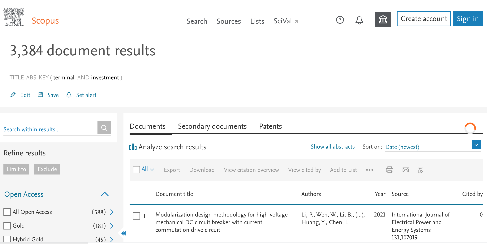
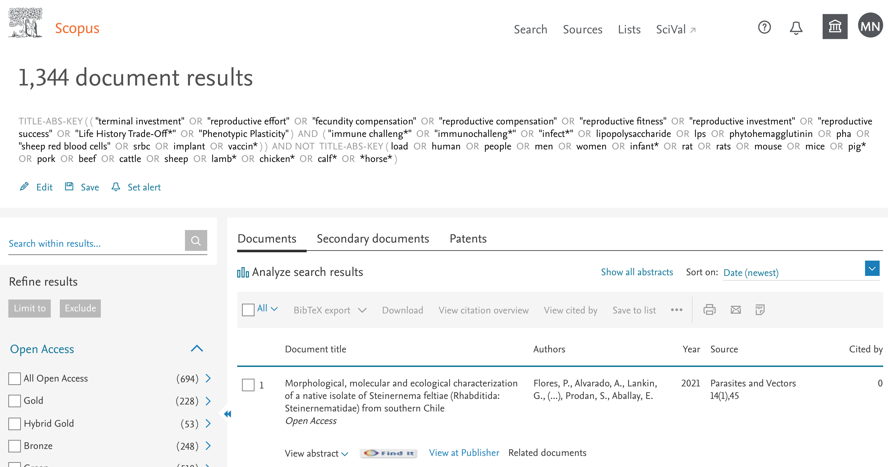
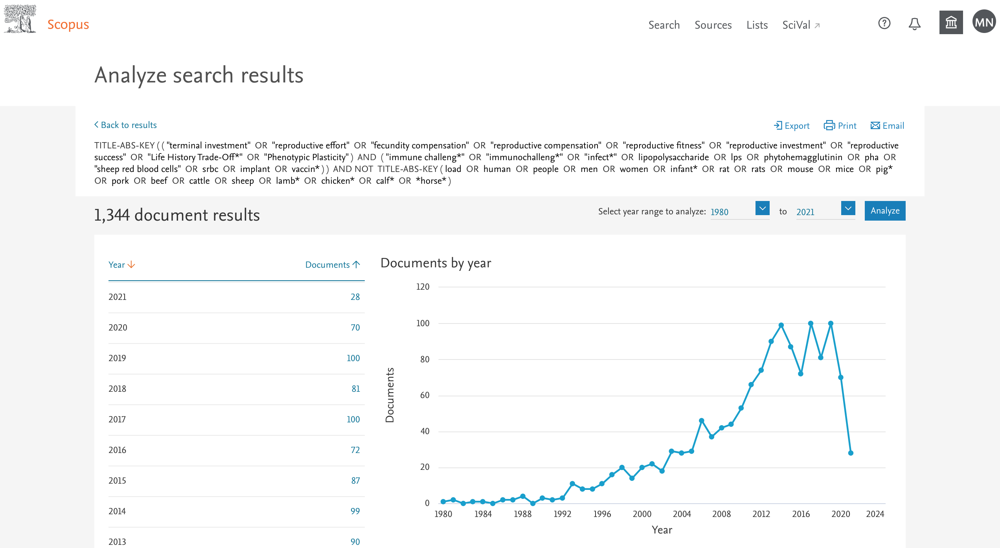

```{r mysetup, include=FALSE}
knitr::opts_chunk$set(error = TRUE) #allow some execution errors for demonstration purposes
knitr::opts_chunk$set(eval = TRUE, echo = TRUE, warning = FALSE, collapse = TRUE, comment = "#>")
sessionInfo()
library(bibliometrix)	
```

**Before the lesson:**    
please make sure you got the latest RStudio and latest R version installed.

**Lesson objectives:**   
 * learn to perform a search in academic literature database
 * download results / import into R
 * making simple bibliometric networks and plots  

**Lesson outline:**   
 * About this lesson   
 * Getting the data
 * Summarising the data
 * Bibliographic networks
 *
 *
 * More resouces     
 http://www.bibliometrix.org/documents.html    
 http://revtools.net/   
 
**** 

## About this lesson   

This lesson is prepared for these who are already familiar with R coding language, R markdown and RStudio.
By the end of this tutorial you should be able to create a simple html document containing  markdown-formatted text, images and R code, all in R Studio.


****

## Getting the data

You can do analyses of literature on any topic. 
In this lesson we will have a look at the academic literature related to the concept of Terminal Investment.
Terminal Investment hypothesis predicts increased investment of resources into reproduction as the chances of survival decrease. This can be observed as increased reproductive effort in older animals or in animals challenged with factors signalling threat to their survival (e.g. predation, pathogenes, parasites).    

Terminal investment in animals is usually studied in three main ways:     
 1. via observational studies of correlations of age and reproductive effort,      
 2. in experimantal studies where animals are subject to immune challenges and their subsequent reprodactive effort is compared to unchallenged aninmals of the same age,    
 3. in experimantal studies where reproductive response to immune challenge is compared between animals of older ages versus younger ages.   

You can read more on this Wiki page: https://en.wikipedia.org/wiki/Terminal_investment_hypothesis   

We hope the topic is quite appealing and quiet easy to understand.There are several published reviews on terminal investment hypothesis and we can expect many publications related to this topic, as well as many researchers working on it. Is this so?  

Thus, we will try to run bibliometric analyses on the relevant sample of literature. Note that some R packages (and many other online/software tools) are available (and more are being developed) that can perform some of the tasks during this exercise, and often much more. For your own project you may want to try to use some of them, but there is no single "perfect" tool fit for all possible analyses and that is easy and usable for all disciplines and types of research questions. Note that the main purpose of this exercise is to familiarize you with the basic principles/issues of bibliometric analyses, you can always learn more in your own time if you are interested.       

# The search
First we need to find a representative sample of academic publications on our topic of choice. For this, we will use cross-disciplianary database of academic literature, Scopus. This database has the largest coverage of the published literature and should give us the most complete picture.   
Note that we have free access to this database on campus, but you will not be able to access it from outside the campus unels (you use UNSW or other unoversity proxy servers).    
The alternative database, commonly used for borad academic literature searches and analyses, is Web of Science (https://www.webofknowledge.com/).   

****   

### TASK 1    
Go to Scopus search page: https://www.scopus.com/search/  and enter "terminal investment" in the basic search window, as follows:  
```{r Scopus_TI_res_simple_search, echo=FALSE, fig.cap=" ", out.width='80%'}
knitr::include_graphics("images/Scopus_TI_res_simple_search.png")
```

****   

Press "Search"" button. You shoud see somethink like this:   

****   

```{r Scopus_TI_res_simple_search_res, echo=FALSE, fig.cap=" ", out.width='80%'}

```

****   

Hey, this does not look good... - very few documents were found and some of them are completely unrelated (building shipping terminals).   
Why is that?    

****   

This is becouse our search is too simple. It allows us only to find the papers that explicitly mention "terminal investment" phrase in their title, abstract or keywords. We need a more sophisticated approach to finding a better set of papers to analyse. Also, we will focus our topic a little bit more and aim to find papers that use immune challenge approach in wils or semi wild animal species (we should exclude established lab model species such as mice and rats, domesticated animals such as dogs and pigs, and humans). Finding the best search string is a bit of an art, so we just provide you with this one to save time:   

```
(TITLE-ABS-KEY ( ( "terminal investment"  OR  "reproductive effort"  OR  "fecundity compensation"  OR  "reproductive compensation"  OR  "reproductive fitness"  OR  "reproductive investment"  OR  "reproductive success"  OR  "Life History Trade-Off*"  OR  "Phenotypic Plasticity" )  AND  ( "immune challeng*"  OR  "immunochalleng*"  OR  "infect*"  OR  lipopolysaccharide  OR  lps  OR  phytohemagglutinin  OR  pha  OR  "sheep red blood cells"  OR  srbc  OR  implant  OR  vaccin* ) )  AND NOT  TITLE-ABS-KEY ( load  OR  human  OR  people  OR  men  OR  women  OR  infant*  OR  rat  OR  rats  OR  mouse  OR  mice  OR  pig*  OR  pork  OR  beef  OR  cattle  OR  sheep  OR  lamb*  OR  chicken*  OR  calf*  OR  *horse* ))  
```

****   

### TASK 2    
You need to copy and paste the above search string into the Avanced Search tab of the Scopus Search page:

```{r Scopus_TI_res_all_adv_search.png, echo=FALSE, fig.cap=" ", out.width='80%'}
knitr::include_graphics("images/Scopus_TI_res_all_adv_search.png")
```

****   

Press "Search"" button. You shoud see somethink like this:   

****   

```{r Scopus_TI_res_all.png, echo=FALSE, fig.cap=" ", out.width='80%'}

```

****   

There are over 1,000 records retrieved from the Scopus database (some look relevant and many are not, but thats always the case). On the left of the results window you can see simple filters: year, most common author names, subject areas, etc. You can explore the whole set roughly by using "Analyze search results" link above the table of the hits:   

```{r New_R_markdown_popup, echo=FALSE, fig.cap=" ", out.width='80%'}

```

****   

### TASK 3    

Next, we will export them for more detailed bibliometric analyses in R. To do so, close tha Scopus analyses window to  go back to the list of records found. First select all records by clicking box "All" in the left top of the list of references. Then click the "Export" link to the right.    

A pop-up window with the export options will appear. First, select the format of the export: 
Second, select which fields have to be exported by clicking the boxes on top of each column (or as needed).
For bibliometric analyses on the citations among papers, it is essential to tick the box next to "Include references" (i.e. data on the cited documents).   

Note that, unfortunately, Scopus limits number of exported records to 2000. For longer listes of records, you will need to split them in smaller chunks for the export and then merge into a single larger dataset (not covered in this tutorial. WoS export limits are 500 records.)    

```{r Scopus_TI_res_all_export_bib, echo=FALSE, fig.cap=" ", out.width='80%'}
knitr::include_graphics("images/Scopus_TI_res_all_export_bib.png")
```

****   

Click "Export" button. A file named "Scopus" (with extension matching your export type file e.g. ris) will be saved to your downloads folder.    
Note that when you export references with their reference lists included in the records, the resulting files are quite large (in our case around 16Mb).   

In case you did not succeed expoerting the files (or wish to work with exactly the same ones we used, or you cannot acces Scopus), the files downloaded on 27/05/2019 are provided in the /data subdirectory.   

****   

### TASK 4    

Create a new Rmarkdown file to save your code (you can do this within new RStudio project).
Install and upload *bibliometrix* R package (you may also need *readxl* and *tidyverse*):


```{r upload packages, eval=FALSE}
install.packages("bibliometrix", dependencies=TRUE) ### installs bibliometrix package and dependencies
library(bibliometrix)	#uploads the package
#library(readxl)
#library(tidyverse)
#utput not displayed for this chunk
```

Next, Upload files exported from Scopus into RStudio. Then convert them into internal bibliometrix format.  

```{r upload data, eval=TRUE}
tmp <- readFiles("data/scopus.bib")
bib <- convert2df(tmp, dbsource = "scopus", format = "bibtex") # Convert to a bibliometric data frame
names(bib)
#write.csv(bib, "data/bib_as_df.csv", row.names = FALSE) #save as a data frame
```

After some processing, an object called "bib" is created. It contains a data frame with each row corresponsing to one exported publication from Scopus and with each column corresponsing to a field exported from Scopus online database. (Note, if you tried to achieve this by exporting a csv file directly from Scopus, you would get a meessy data frame, due to missing field values shifting the cells between columns). 

****   

### TASK 5    
What are the contents of the columns of our "bib" data frame?  Columns are labelled with a two-letter tags: `r names(bib)`.    
For a complete lost of field tags used in *bibliometrix* you can have a look at this file:   http://www.bibliometrix.org/documents/Field_Tags_bibliometrix.pdf   
Our data frame contains just a subset of these codes. Which ones?   
 
Note that column **bib$AU** contains authors of each paper (as surenames and initials) separated by semicolon (;). We can split these strings and can extract a list of all author names to a vector:    

```{r get author names, eval=TRUE}
head(bib$AU) #have a look at the few few records
authors <- bib$AU
authors <- unlist(strsplit(authors, ";")) #split the records into individual authors at ; and vectorize
authors <- authors[order(authors)] #order alphabetically
head(authors) #have a look again
# View(unique(authors)) #use to see all the values
# write.csv(authors, "data/author_list_uncleaned.csv", row.names = FALSE) #you can save this in a file
```

****   

### TASK 6    
Cited references for each inculded paper are in the CR column of the "bib" data frame. They are in a single string, also seperated by semicolon (;). We can have a look at them and check whether familiar names were cited, e.g.:   

```{r  citations, eval=TRUE}
names(bib)
#bib$CR[1] #display a list of cited references for the first paper in the data frame (it is a long string!)
#look whether some of these names are cited:
grep("NAKAGAWA", bib$CR) #no
grep("CORNWELL, W.", bib$CR) #yes, 1 (still, this could be some other W. CORNWELL...)
```

****   

## Summarising the data

### TASK 7    

Luckily, *Bibliometrix* package  has a handy function that summarises the information contained in the "bib" data frame, so we can get some quick facts about our set of papers:    

```{r  descriptive tables, eval=TRUE}
# Preliminary descriptive analysis 
results <- biblioAnalysis(bib, sep = ";")
summary(object = results, k = 20, pause = TRUE) 
```

Using summary function on *bibliometrix* results, we get several screens with various tables summarising bibliometric data from our data frame - how many documents, journals, keywords, authords, publicaton timespan, collaboration index, annual publication growth rate, most prolific authors, publications per country, per journal, per keywords, etc.    

You can plot five of these tables (hit "return"" to displey next graph, and later you can use arrows in the top left of the plots pane to move back and forth between consequtive graphs saved in the RStudio memory):   

```{r  descriptive plots, eval=TRUE}
plot(results, k = 20, pause=TRUE) #this takes top 20 values from each plottable table

#the code below is for saving these plots into a pdf
# pdf(file = "plots/bib_descriptive_plots.pdf", height = 8, width = 8, pointsize=10) #
# plot(results, k = 20, pause=FALSE) #this takes top 20 values from each plottable table
# dev.off()
```


****   

### TASK 8    
The cited papers from the CR field of the data frame can be analysed using function *citations*.   
Function *citations* makes it easy to generate the frequency tables of the most cited papers or the most cited first authors from the reference lists of our papers downloaded from Scopus.    

Ten most cited papers:   

```{r  most cited papers, eval=TRUE}
mostcited <- citations(bib, field = "article", sep = ";")
cbind(mostcited$Cited[1:10])
```

Ten most cited authors:

```{r  most cited authors, eval=TRUE}
mostcited <- citations(bib, field = "author", sep = ";")
cbind(mostcited$Cited[1:10])
```


The function *localCitations* generates the frequency table of the **locally** most cited authors. Locally, means that only citations are counted only within the given data set - i.e.  how many times an author/paper that is in this data set has been cited by other authors/papers also in the data set.

Ten most frequent local cited authors and papers:

```{r  most cited local authors, eval=TRUE}
mostcited <- localCitations(bib, sep = ";")
mostcited$Authors[1:10,]
mostcited$Papers[1:10,]
```

****  

## Bibliographic networks

So far, we looked only at the numbers - who or what gets cited most, either from the main papers list or from the lists of the references within these papers. Now it is time to look at the actual networks of citations and also other types of networks that can be created using our data set.   

To do so we will be creating various rectangular matrices which reflect connections of different attributes of Papers/Authors. These matrices than can be plotted as bipartite networks and analysesd.  

Co-citation or coupling networks are a special type of newtorks resulting from scientific papers containing references to other scientific papers.   

Package *bibliometrix* contains function *biblioNetwork* which makes creating bibliomgraphic networks easy.  This function can create the most frequently used coupling networks: Authors, Sources, and Countries.   


****  

### TASK 9    
**Bibliographic coupling** - two articles are bibliographically coupled if they share at leas one reference from their reference lists (i.e. at least one cited source appears in the reference lists/bibliographies of both papers (Kessler, 1963).    

```{r  paper coupling network, eval=TRUE}
NetMatrix <- biblioNetwork(bib, analysis = "coupling", network = "references", sep = ";")
net=networkPlot(NetMatrix,  normalize = "salton", weighted=NULL, n = 10, Title = "Papers' bibliographic coupling", type = "fruchterman", size=5, size.cex=T, remove.multiple=TRUE, labelsize=0.5, label.cex=F)
```

Above, we plotted only the top 10 most coupled papers (n=10), try increasing this number to 100 (would not recommend further increasing the number of displayed nodes - it gets slow and messy).   
What happens and why?    
  
****  

### TASK 10    
**Author's bibliographic coupling** - two authors are bibliographically coupled if they share at leas one reference form their reference lists.    

```{r  author coupling network, eval=TRUE}
NetMatrix <- biblioNetwork(bib, analysis = "coupling", network = "authors", sep = ";")
net=networkPlot(NetMatrix,  normalize = "salton", weighted=NULL, n = 10, Title = "Authors' bibliographic coupling", type = "fruchterman", size=5,size.cex=T,remove.multiple=TRUE,labelsize=0.8, label.n=10, label.cex=F)
```

Above, we plotted only the top 10 most coupled authors (n=10), try increasing this number to 100 (would not recommend further increasing the number of displayed nodes - it gets slow and messy).   
What happens and why?    
  
****  

### TASK 11     
**Bibliographic co-citation** is kind of opposite to bibliographic coupling, in so that two papers are linked by co-citatio when both are cited in a third papers.    

```{r  paper co-citation network, eval=TRUE}
NetMatrix <- biblioNetwork(bib[1:50,], analysis = "co-citation", network = "references", sep = ";")
net=networkPlot(NetMatrix, normalize = "salton", weighted=NULL, n = 50, Title = "Papers' co-citations", type = "fruchterman", size=5, size.cex=T, remove.multiple=TRUE, labelsize=0.5, label.cex=F)
```

Note that for creating this matrix we only used first 50 papers from our data set - this is because the resulting matrix is a matrix of ALL cited papers and it gets HUGE). Also, we plotted only the top 10 most coupled papers (n=10), try increasing this number to 50 (would not recommend further increasing the number of displayed nodes - it gets slow and messy).   
What happens and why?    


****  

### TASK 12     
**Bibliographic collaboration** is a network where nodes are authors and links are co-authorships on the papers.     

```{r  author collaboration network, eval=TRUE}
NetMatrix <- biblioNetwork(bib, analysis = "collaboration", network = "authors", sep = ";")
net=networkPlot(NetMatrix,  normalize = "salton", weighted=NULL, n = 10, Title = "Authors' collaborations", type = "fruchterman", size=5, size.cex=T, remove.multiple=TRUE, labelsize=0.5, label.cex=F)
```
Above, we plotted only the top 10 most collaborating authors (n=10), try increasing this number to 100 (would not recommend further increasing the number of displayed nodes - it gets slow and messy).   
What happens and why?    

****  

### TASK 13     
**Country Scientific Collaboration** - we can visualise authors from which countries publish papers together most frequently.   

```{r  country collaboration network, eval=TRUE}
bib <- metaTagExtraction(bib, Field = "AU_CO", sep = ";") #we need to extrcat countries from the affiliations first
NetMatrix <- biblioNetwork(bib, analysis = "collaboration", network = "countries", sep = ";")
net=networkPlot(NetMatrix, n = 100, Title = "Country Collaboration", type = "auto", size=TRUE, remove.multiple=FALSE, labelsize=0.5)
```
Above, we plotted only the top 10 most collaborating countrie (n=10), try increasing this number to 100 (would not recommend further increasing the number of displayed nodes - it gets slow and messy).   
What happens and why? 

****  

### TASK 14     
**Keyword co-occurrences** - we can also visualise which papers share most keywords (from Scopus database).    

```{r  keyword co-occurance network, eval=TRUE}
NetMatrix <- biblioNetwork(bib, analysis = "co-occurrences", network = "keywords", sep = ";")
net=networkPlot(NetMatrix, n = 50, Title = "Keyword co-occurance", type = "fruchterman", size=T, remove.multiple=FALSE, labelsize=0.7, edgesize = 5)
```
try replacing network = "keywords" with network = "author_keywords" and see what happens. You can also try to display fewer/more keywords in the plot.   

****  

### TASK 15  (SKIP - too BIG, multiple plots)   
**Co-Word Analysis** - uses the word co-occurrences in a bibliographic collection to map the conceptual structure of research. It works via a separate function *conceptualStructure* that creates a conceptual structure map of a scientific field performing Correspondence Analysis (CA), Multiple Correspondence Analysis (MCA) or Metric Multidimensional Scaling (MDS) and Clustering of a bipartite network of terms extracted from keyword, title or abstract fields of the data frame.   

```{r  conceptualStructure map, eval=FALSE}
CS <- conceptualStructure(bib, field="ID", method="CA", minDegree=4, k.max=8, stemming=FALSE, labelsize=10, documents=10)
```

The code above uses field ID, which stands for "conceptualStructure". Try using authors keywords, "DE" field, instead. Is the map different?   

****  

### TASK 15 (bit slow)     
**Historical Direct Citation Network** - represents a chronological network map of most relevant direct citations in a bibliographic collection, i.e who is citing whom and in what order.
*histNetwork* function calculates a chronological direct citation network matrix which then is plotted using *histPlot*:

```{r  histNetwork, eval=TRUE}
#options(width=130)
histResults <- histNetwork(bib, min.citations = 10, sep = ";")
net <- histPlot(histResults, n=15, size = 20, labelsize=10, size.cex=TRUE, arrowsize = 0.5, color = TRUE)
```


**MORE**
You can use different types of network plots - just tweak "type" parameter in the *networkPlot* function (check the vignette for the available options). Type indicates the network map layout: circle, kamada-kawai, mds, etc.     

You can use non-R tools to visualise bibliographic networks, e.g. VOSviewer software by Nees Jan van Eck and Ludo Waltman (http://www.vosviewer.com). When in R function you usetype=“vosviewer”, the function will export the network a standard "pajek" network file (named “vosnetwork.net”), which can be used in other network-plotting software, including VOSviewer.   


****   

## RESOURCES
* Bibliometrix webpage: http://www.bibliometrix.org/
* A more detailed *bibliometrox* package tutorial: https://cran.r-project.org/web/packages/bibliometrix/vignettes/bibliometrix-vignette.html   


```{r other bipartite matrices, eval=FALSE, include=FALSE}
#source network
A <- cocMatrix(bib, Field = "SO", sep = ";")
sort(Matrix::colSums(A), decreasing = TRUE)[1:5]
str(A)
#Citation network
A <- cocMatrix(bib, Field = "CR", sep = ".  ")
#Author network
A <- cocMatrix(bib, Field = "AU", sep = ";")
#Country network
#Authors’ Countries is not a standard attribute of the bibliographic data frame. You need to extract this information from affiliation attribute using the function metaTagExtraction.
M <- metaTagExtraction(bib, Field = "AU_CO", sep = ";")
A <- cocMatrix(bib, Field = "AU_CO", sep = ";")
#metaTagExtraction allows to extract the following additional field tags: Authors’ countries (Field = "AU_CO"); First Author’s countries (Field = "AU_CO"); First author of each cited reference (Field = "CR_AU"); Publication source of each cited reference (Field = "CR_SO"); and Authors’ affiliations (Field = "AU_UN").
#Author keyword network
A <- cocMatrix(bib, Field = "DE", sep = ";")
#Keyword Plus network
A <- cocMatrix(bib, Field = "ID", sep = ";")
```


```{r old bibliometrix, eval=FALSE, include=FALSE}
######################################### OLD #############

# Convert to a bibliometric data frame
bib <- convert2df(tmp, dbsource = "isi", format = "bibtex")
test <- bib$AU
test2 <- unlist(strsplit(test, ";"))
test2 <- test2[order(test2)]z
#View(test2) #see which names need cleaning
write.csv(test2, "author_list_uncleaned.csv", row.names = FALSE)

# Do some cleaning (fix author initials)
test3 <- paste(test, ";", sep="")
corrected <- gsub("ALLISON D;", "ALLISON DB;", test3, ignore.case = TRUE)
corrected <- gsub("ANDERSON R;", "ANDERSON RM;", corrected, ignore.case = TRUE)
corrected <- gsub("AUSTAD S;", "AUSTAD SN;", corrected, ignore.case = TRUE)
corrected <- gsub("BROOKS R;", "BROOKS RC;", corrected, ignore.case = TRUE)
corrected <- gsub("CAREY J;", "CAREY JR;", corrected, ignore.case = TRUE)
corrected <- gsub("CARVALHO G;", "CARVALHO GB;", corrected, ignore.case = TRUE)
corrected <- gsub("DEBETS A;", "DEBETS AJM;", corrected, ignore.case = TRUE)
corrected <- gsub("HARSHMAN L;", "HARSHMAN LG;", corrected, ignore.case = TRUE)
corrected <- gsub("HOEKSTRA R;", "HOEKSTRA RF;", corrected, ignore.case = TRUE)
corrected <- gsub("INGRAM D;", "INGRAM DK;", corrected, ignore.case = TRUE)
corrected <- gsub("JENNIONS M;", "JENNIONS MD;", corrected, ignore.case = TRUE)
corrected <- gsub("KENNEDY B;", "KENNEDY BK;", corrected, ignore.case = TRUE)
corrected <- gsub("LAMMING D;", "LAMMING DW;", corrected, ignore.case = TRUE)
corrected <- gsub("LEROI A;", "LEROI AM;", corrected, ignore.case = TRUE)
corrected <- gsub("MAAS M;", "MAAS MFPM;", corrected, ignore.case = TRUE)
corrected <- gsub("MCMAHAN C;", "MCMAHAN CA;", corrected, ignore.case = TRUE)
corrected <- gsub("MUELLER H;", "MULLER HG;", corrected, ignore.case = TRUE)
corrected <- gsub("MULLER H;", "MULLER HG;", corrected, ignore.case = TRUE)
corrected <- gsub("PENDERGRASS W;", "PENDERGRASS WR;", corrected, ignore.case = TRUE)
corrected <- gsub("PIPER MDW;", "PIPER M;", corrected, ignore.case = TRUE)
corrected <- gsub("PLETCHER S;", "PLETCHER SD;", corrected, ignore.case = TRUE)
corrected <- gsub("SINCLAIR D;", "SINCLAIR DA;", corrected, ignore.case = TRUE)
corrected <- gsub("SMITH G;", "SMITH GK;", corrected, ignore.case = TRUE)
corrected <- gsub("SMITH M;", "SMITH MJ;", corrected, ignore.case = TRUE)
bib$AU <- corrected #add corrections

#save as a data frame
write.csv(bib, "bib_as_df.csv", row.names = FALSE)

#look whether some of these names are cited
grep("SINCLAIR", bib$CR)
grep("KAEBERLEIN", bib$CR)

##########################################################################################
# Preliminary descriptive analysis 
results <- biblioAnalysis(bib, sep = ";")
summary(object = results, k = 20, pause = FALSE)

#####################  Figure - SKIP  ####################################################
pdf(file = "bib_4descriptive.pdf", height = 8, width = 8, pointsize=10)
par(mfrow=c(2,2), mar = c(4,4,1,1))
plot(results, k = 20, pause=FALSE)
dev.off()

# What are the most frequently cited manuscripts?
CR <- citations(bib, field = "article", sep = ".  ")
str(CR)

#####################  Figure - CO-AUTHORS NETWORK  ####################################################
pdf(file="Figure_collaboration_network.pdf", width=8, height=8, pointsize=10)
par(mfrow=c(1,1), mar=c(0,0,0,0))
M <- metaTagExtraction(bib, Field = "CR_AU", sep = ";")
NetMatrix <- biblioNetwork(M, analysis = "collaboration", network = "authors", sep = ";")
net <- networkPlot(NetMatrix, n = 100, cluster="walktrap", Title = "", labelsize = 1, type = "fruchterman", size=TRUE, remove.multiple=TRUE)	
dev.off() #note, changing n alters the colurs and arrangements of the authors and clusters
###################################################################################

#Note: countries cannot be extracted from our bib


#####################  Figure - HISTORICAL CO-CITATION NETWORK  ####################################################
pdf(file="Figure_historical_network.pdf", width=8, height=8, pointsize=10)
par(mfrow=c(1,1), mar=c(0,0,0,0))
M <- metaTagExtraction(bib, Field = "CR_AU", sep = ";")
histResults <- histNetwork(M, n=143, sep = ";") # "n" (number of most cited references to select) picked manually, larger numbers give error
histPlot(histResults, size=TRUE, arrowsize = 0.2) 
dev.off()
###################################################################################


### CITATIONS

#co-ciation network
M <- metaTagExtraction(bib, Field = "CR_AU", sep = ";")
NetMatrix <- biblioNetwork(M, analysis = "co-citation", network = "authors", sep = ";")
#NetMatrix <- biblioNetwork(M, analysis = "co-citation", network = "references", sep = ";")
net <- networkPlot(NetMatrix, n = 100, type = "kamada", Title = "Co-Citation", labelsize=0.5) #odd?

## Bipartite network of the existing networkds
M <- metaTagExtraction(bib, Field = "CR_AU", sep = ";")
# Co-Citation network of the existing studies
CRnet <- cocMatrix(M, Field = "CR", sep = ".  ")
net <- networkPlot(CRnet, n = 50, labelsize = 0.3, size=TRUE, weighted = TRUE)	
##### Error in graph.adjacency.sparse(adjmatrix, mode = mode, weighted = weighted, : not a square matrix

### BIBLIOGRAPHIC COUPLING
NetMatrix <- biblioNetwork (M, analysis = "coupling", network = "references", sep = ";")
net <- networkPlot(NetMatrix, n = 1000, cluster="walktrap", Title = "Bibliographic Coupling Network", label = FALSE, labelsize = 1, type = "kamada", size=TRUE, remove.multiple=TRUE)	
# odd - too few connections 


###################################################################################

## THEMATIC MAP
M <- metaTagExtraction(bib, Field = "CR_AU", sep = ";")
NetMatrix <- biblioNetwork(M, analysis = "co-occurrences", network = "keywords", sep = ";")
S <- normalizeSimilarity(NetMatrix, type = "association")
net <- networkPlot(S, n = 500, Title = "co-occurrence network", type="fruchterman", labelsize = 0.7, halo = FALSE, cluster = "walktrap",remove.isolates=FALSE, remove.multiple=FALSE, noloops=TRUE, weighted=TRUE)
#too dense dont use for plot (try letter with smaller n)

#####################  Figure - THEMATIC MAP  ####################################################
pdf(file="Figure_thematic_map.pdf",width=8,height=8,pointsize=10)
net <- networkPlot(S, n = 100, Title = "co-occurrence network", type="fruchterman", labelsize = 0.7, halo = FALSE, cluster = "walktrap",remove.isolates=FALSE, remove.multiple=FALSE, noloops=TRUE, weighted=TRUE)
res <- thematicMap(net, NetMatrix, S)
plot(res$map)
dev.off()
#########################################################################

#####################  Figure - TOPIC NETWORK  ####################################################
pdf(file="Figure_topic_network.pdf",width=8,height=8,pointsize=10)
net <- networkPlot(S, n = 60, Title = "", type="fruchterman", labelsize = 0.7, halo = FALSE, cluster = "walktrap",remove.isolates=FALSE, remove.multiple=FALSE, noloops=TRUE, weighted=TRUE)
dev.off()
#########################################################################

#Conceptual structure
CS <- conceptualStructure(bib, field="AB", minDegree=4, k.max=10, stemming=FALSE, labelsize=10)	#too dense
```

